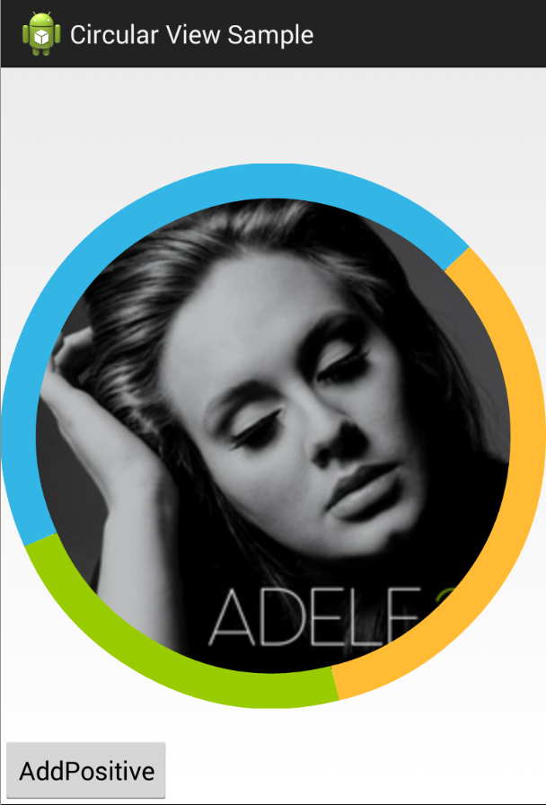

Android-CircularView
====================

This view is intended to display Circular view composed of 2 circles. Inner circle to show standard content cropped into
circle, and outer to display PieChart-like portions of added items. Added items should be of any type (subclass of Object
in future only parcelable objects to save its state?) and contains following description (See CircularView.ItemDescriptor
class):
* score : score of item. As result item will have drawn its portion of outer circle computed as:
```item.score / scoreSum * 360°```
* paint color: color in which outer circle will display percentage of current item



The library is currently stored in Sonatype repository an could be easily obtained via gradle tools. Just add these lines and let gradle synchronize its dependencies:
```
repositories{
    ...
    maven { url 'http://maven.ow2.org/maven2/' }
}
dependencies {
    ...
    compile 'com.github.vizghar.circularview:lib:0.0.1'
}
```
Now that you can use the library simply use it in your layout file as follows (I'm sorry for the difference between package name and gradle group name, it was the sonatype requirement to change group name):
```XML
<LinearLayout xmlns:android="http://schemas.android.com/apk/res/android"
    xmlns:app="http://schemas.android.com/apk/res-auto"
    android:layout_width="match_parent"
    android:layout_height="match_parent"
    android:orientation="vertical">

    <sk.kandrac.circularview.CircularView
        android:id="@+id/circle"
        android:layout_width="match_parent"
        android:layout_height="wrap_content"
        android:background="@android:color/darker_gray"
        android:onClick="circleClick"
        android:padding="0dp"
        app:outer_width="50dp"
        app:rotate_speed="1"
        app:default_color="@android:color/black">


        <ImageView
            android:layout_width="match_parent"
            android:layout_height="match_parent"
            android:src="@drawable/adele" />

    </sk.kandrac.circularview.CircularView>
</LinearLayout>
```
Circular view should contain only one Child of any View type... At least ImageView and ScrollView works well. Curently you can set following properties for Circular View (given properties are default):
* `outer_width` as width of outer cycle
* `rotate_speed` as speed multiplier (default multiplier is quite fast)
* `default_color` as color to be displayed if no item is inserted

For each property exists programmatic alternative:
* `getOuterWidth()` & `setOuterWidth(int)`
* `getRotateSpeed()` & `setRotateSpeed(float)`
* `getDefaultPaintColor()` & `setDefaultPaintColor`

Other properties will be added later (as enabling/disabling touch gestures in outer cycle, custom animations, adapter view like CircularView etc.)

After this settings you can add items to outer cycle with `addItem()` methods. Best alternative is to use directly `addItem(Object item, float score, int color)` method. The method adds new item descriptor to CircularView with score and color set. For example see this code:
```
circularView.addItem(positive, 1, getResources().getColor(R.color.blue));
circularView.addItem(negative, 2, getResources().getColor(R.color.green));
circularView.addItem("unknown", 3, getResources().getColor(R.color.orange));
```
3 items were added (Object `positive` with score of 1 and blue representative color etc.). The visual result will be CircularView as in the sample image (Blue color will take 1/6, green 2/6, and blue 3/6 of outer cycle).

Last part is further changing the items:
* `getItemScore(Object)` - to get score of selected item
* `setItemScore(Object, float)` - to set score for selected item
* `addItemScore(Object, float)` - to increase score of selected item by specified value
* `getItemColor(Object)` - to get color of selected item
* `setItemColor(Object, int)` - to set color for selected item

If you want to see full example please see my 
